## 1. Introduction

    The property theory of traditional Chinese medicine (TCM) is a unique medical theory based on extensive clinical practice for thousands of years, guiding TCM practitioners in choosing proper medicines to treat specific diseases. The target organs, flavors, and toxicities of TCM are a high generalization of the drug's characteristics according to the property theory. Despite intensive investigations, the accurate identification of TCM properties still confronts several challenges, which greatly hampers the clinical rational application and novel drug discovery of TCM.

Herein, the TCM Artificial Intelligence-Powered Platform (TCM-AIPP) has been developed leveraging state-of-the-art deep learning technologies. TCM-AIPP contains three predictive tools that not only identify the potential target organs, tastes and toxicities of TCM, but also provide comprehensive information on TCMs and corresponding compounds, including candidate target profiling and functional enrichment data. Notably, this web server offers flexible and diverse forms of network visualization, for which users can choose to display different relationships among herbs, compounds, targets, target organs, flavors, and toxicities according to their research aims, as well as design and modify the network nodes and edges at will.

Uncovering the properties of TCM is of great importance for both clinical applications and TCM-derived drug R&D. TCM-AIPP may help to facilitate the recognition of the properties of TCMs, explain the underlying mechanisms of TCM against various human diseases, and provide guidance for TCM practitioners.

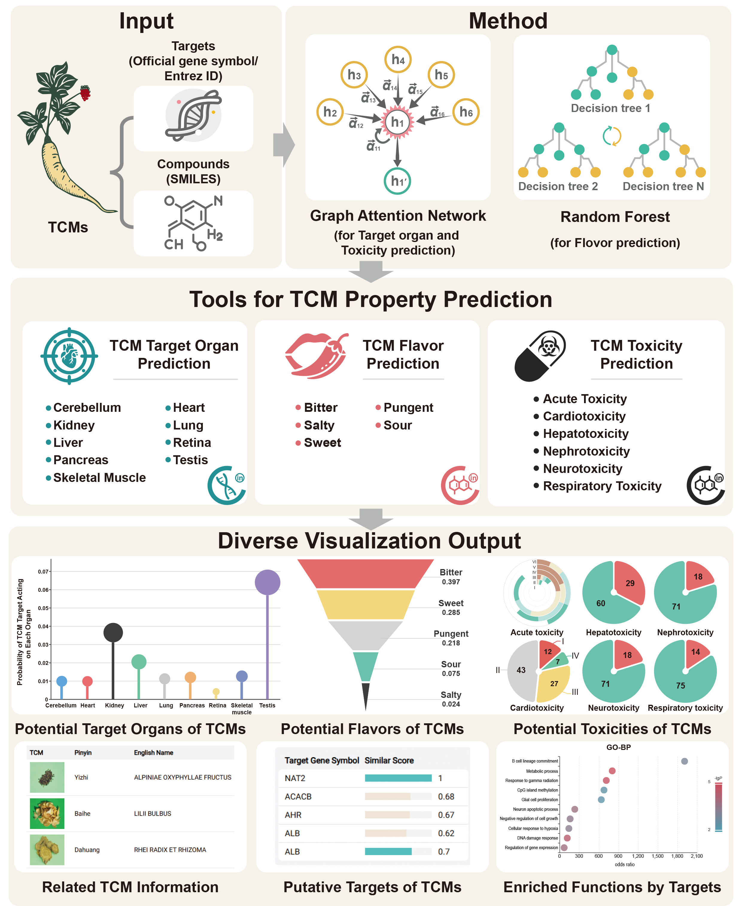
**
Figure 1. Overview framework of TCM-AIPP
**

### 1.1 Highlights

    <strong>①</strong> TCM-AIPP is the first web server for TCM property research 
    <strong>②</strong> TCM-AIPP integrated the specific characteristics of TCMs to enhance its prediction performance 
    <strong>③</strong> TCM-AIPP provides an intuitive interface and customizable network visualizations, facilitating the exploration of TCM-related bioinformation

### 1.2 Citations

    <strong>①</strong> Zhang Y, Li X, Shi Y, Chen T, Xu Z, Wang P, Yu M, Chen W, Li B, Jing Z, Jiang H, Fu L, Gao W, Jiang Y, Du X, Gong Z, Zhu W, Yang H, Xu H. ETCM v2.0: An update with comprehensive resource and rich annotations for traditional Chinese medicine. Acta Pharm Sin B. 2023 Jun;13(6):2559-2571. [doi: 10.1016/j.apsb.2023.03.012](https://pubmed.ncbi.nlm.nih.gov/37425046/) 
    <strong>②</strong> Xu HY, Zhang YQ, Liu ZM, Chen T, Lv CY, Tang SH, Zhang XB, Zhang W, Li ZY, Zhou RR, Yang HJ, Wang XJ, Huang LQ. ETCM: an encyclopaedia of traditional Chinese medicine. Nucleic Acids Res. 2019 Jan 8;47(D1):D976-D982. [doi: 10.1093/nar/gky987](https://pubmed.ncbi.nlm.nih.gov/30365030/) 
    <strong>③</strong> Zhang Y, Wang N, Du X, Chen T, Yu Z, Qin Y, Chen W, Yu M, Wang P, Zhang H, Zhou X, Huang L, Xu H. SoFDA: an integrated web platform from syndrome ontology to network-based evaluation of disease-syndrome-formula associations for precision medicine. Sci Bull (Beijing). 2022 Jun 15;67(11):1097-1101. [doi: 10.1016/j.scib.2022.03.013](https://pubmed.ncbi.nlm.nih.gov/36545970/) 
    <strong>④</strong> Liu Y, Xu J, Yu Z, Chen T, Wang N, Du X, Wang P, Zhou X, Xu H, Zhang Y. Ontology characterization, enrichment analysis, and similarity calculation-based evaluation of disease-syndrome-formula associations by applying SoFDA. Imeta. 2023 Jan 10;2(2):e80. [doi: 10.1002/imt2.80](https://pubmed.ncbi.nlm.nih.gov/38868426/)

## 2. Model Info

### 2.1 Model information and validation

A total of three tools for predicting target organs, flavors and toxicities of TCMs were constructed and developed in the TCM-AIPP web server based on Random Forest (RF) machine learning and Graph Attention Network (GAT), respectively. These tools contain 19 prediction models, including 10 classification models and 9 regression models. For each endpoint, the dataset is randomly divided into training, validation (VAL) and test sets in the ratio of 8:1:1. The RF model is implemented using the tree ensemble learner and predictor nodes in KNIME, Gini coefficient is used for segmentation criteria, square root function is used for attribute sampling and different sets of attributes are selected for all trees. The GAT employs an Adam optimizer with hyperparameter tuning via Bayesian optimization. The regression task was assessed using the coefficient of determination (R2), root mean squared error (RMSE), and mean absolute error (MAE), whereas the classification task was evaluated based on accuracy, the area under the receiver operating characteristic (ROC-AUC) curve, Mathews correlation coefficient (MCC), precision, specificity and sensitivity. To guarantee the reliability and precision of the models, each training process was conducted 10 times, and the most effective models were then deployed to the online platform.

### 2.2 TCM target organ prediction

The TCM target organ prediction model was developed based on GAT, which aims to reveal the action tendency of TCM on different organs. The targets of TCM are complex and diverse, and their mechanisms of action are difficult to explain intuitively, so they need to be accurately predicted by systematic network analysis methods. This model can effectively predict the effects of TCM on specific organs by integrating the information of human protein-protein interaction (PPI) network (1) and the effective targets of TCM.

The model was constructed based on a number of reliable data sources. Proteins specifically expressed in each organ were collected from The Human Protein Atlas. These proteins were screened for "Enhanced" and "High" levels of evidence, and occurring only once in all organs. To further substantiate the independence of organ target sets within the PPI network, a network separation analysis was employed to differentiate between organ-specific target sets. In the GAT, organ-specific targets were mapped to the PPI network, and interactions between protein nodes were analyzed through the graph attention mechanism to calculate the specificity scores of different protein nodes for each organ. The model weights integrate the organ-specific scores of each target according to the combination of the effective targets of the TCM, thereby more accurately predicting the tendency of the TCM to target specific organs.

To validate the performance of the model, we collected effective target data with high-quality literature support from the HIT database, which demonstrated optimal prediction quality in several models. A total of 442 TCMs with documented organ effects, as recorded in the Chinese Pharmacopoeia, were subjected to extraction of their corresponding effective targets, amounting to a total of 64,795. During the validation process, if the actual organ of target of a TCM was located in the top three organs predicted by the model (a single TCM is known to target on up to 4 organs), the prediction was considered to be a true-positive result. The model was initially validated for the four organs of the liver, heart, lungs, and kidneys (as documented in the Pharmacopoeia) and achieved a more satisfactory model performance. Subsequently, the validation was extended to encompass modeling of additional organs, including the cerebellum, pancreas, retina, skeletal muscle, and testis. Notably, with the exception of the heart-skeletal muscle, the target sets of these organs showed significant topological separation in the PPI, which further enhanced the predictive performance of the model. 

**
Table 1. Basic information of TCM target organ prediction tool
**

<table style={{borderCollapse: "collapse", width: "80%", margin: "0 auto", textAlign: "center"}}>
  <tr>
    <td style={{backgroundColor: "#009999", color: "white"}}><strong>Organs</strong></td>
    <td>Cerebellum, Heart, Kidney, Liver, Lung, Pancreas, Retina, Skeletal muscle, Testis</td>
  </tr>
  <tr>
    <td style={{backgroundColor: "#009999", color: "white"}}><strong>Algorithmic&nbsp;Model</strong></td>
    <td>Graph Attention Network (3)</td>
  </tr>
  <tr>
    <td style={{backgroundColor: "#009999", color: "white"}}><strong>End Point</strong></td>
    <td>Probability score of TCM effective target acting on a certain organ</td>
  </tr>
  <tr>
    <td style={{backgroundColor: "#009999", color: "white"}}><strong>Descriptors</strong></td>
    <td>Human protein interaction network</td>
  </tr>
  <tr>
    <td style={{backgroundColor: "#009999", color: "white"}}><strong>Standard Dataset</strong></td>
    <td>685 targets</td>
  </tr>
  <tr>
    <td style={{backgroundColor: "#009999", color: "white"}}><strong>Data Sources</strong></td>
    <td>(2)</td>
  </tr>
</table>

### 2.3 TCM flavor prediction

The flavor prediction model of TCM-AIPP was constructed using the RF algorithm. This model evaluates the chemical structural similarities between the input compounds and compounds with known flavors obtained from PubChem, VirtualTaste and ChemTastesDB.

Then, the flavors of TCM were predicted by weighted averaging the compounds' flavors, especially the index compounds recorded by the Chinese Pharmacopoeia 2020 and the other compounds were assigned different weights. The predictive performance of this model was evaluated based on 558 TCMs with the flavor records in the Chinese Pharmacopoeia 2020 and the corresponding 19,068 compounds obtained from BATMAN-TCM. If the actual flavors of a certain TCM are included in the top three predicted flavors of the model (it is generally known that a single TCM have up to 3 flavors), the result may be considered to be true-positive.

**
Table 2. Basic information of TCM flavor prediction tool
**
<table style={{borderCollapse: "collapse", width: "40%", margin: "0 auto"}}>
  <tr>
    <td style={{backgroundColor: "#009999", color: "white"}}><strong>Flavors</strong></td>
    <td>Flavors of compounds</td>
  </tr>
  <tr>
    <td style={{backgroundColor: "#009999", color: "white"}}><strong>Algorithmic Model</strong></td>
    <td>Random Forest (4)</td>
  </tr>
  <tr>
    <td style={{backgroundColor: "#009999", color: "white"}}><strong>End Point</strong></td>
    <td>Sour, Bitter, Sweet, Pungent, Salty</td>
  </tr>
  <tr>
    <td style={{backgroundColor: "#009999", color: "white"}}><strong>Descriptors</strong></td>
    <td>Molecular fingerprints</td>
  </tr>
  <tr>
    <td style={{backgroundColor: "#009999", color: "white"}}><strong>Standard Dataset</strong></td>
    <td>1595 compounds</td>
  </tr>
  <tr>
    <td style={{backgroundColor: "#009999", color: "white"}}><strong>Data Sources</strong></td>
    <td>(4-6)</td>
  </tr>
</table>

### 2.4 TCM toxicity prediction

The toxicity prediction model of TCM-AIPP was constructed using the GAT algorithm.  This model evaluates the chemical structural similarities between the input compounds and compounds with known toxicities obtained from TOXRIC, DIRIL, DrugBank and PubChem. On this basis, TCM-AIPP can predict the potential toxicities [acute and organ toxicities (including cardiotoxicity, hepatotoxicity, nephrotoxicity, neurotoxicity, and respiratory toxicity)] of the input compounds and the toxic risk of TCMs according to the number of toxic compounds in the chemical profiling. In addition, TCM-AIPP also provides the putative targets of the toxic compounds containing TCMs and their enriched biological functions and pathways. These data provide an important reference for the safety evaluation of TCMs and the investigation of the underlying toxic mechanisms.

#### 2.4.1 Acute toxicity

Two prediction models for acute toxicity were developed for different application scenarios based on rat and mouse using the LD50 data collected from the TOXRIC database and the toxicity classification criteria referring to the Globally Harmonized System of Classification and Labelling of Chemicals. To minimize the risk of false negatives and to reduce overfitting, both the Random Oversampling and Adaptive Synthetic Sampling Algorithm (ADASYN) were used to improve the classification accuracy for a few classes of chemicals. The results of the two sampling algorithms are both available on the platform.

**
Table 3. Basic information of TCM acute toxicity prediction tool
**
<table style={{borderCollapse: "collapse", width: "50%", margin: "0 auto"}}>
  <tr>
    <td style={{backgroundColor: "#009999", color: "white"}}><strong>Prediction Type</strong></td>
    <td>Lethal Dose value in mg/kg body weight (Rat and Mouse)</td>
  </tr>
  <tr>
    <td style={{backgroundColor: "#009999", color: "white"}}><strong>Algorithmic Model</strong></td>
    <td>Graph Attention Network (8)</td>
  </tr>
  <tr>
    <td style={{backgroundColor: "#009999", color: "white"}}><strong>End Point</strong></td>
    <td>Toxicity level from GHS (I, II, III, IV, V, VI)</td>
  </tr>
  <tr>
    <td style={{backgroundColor: "#009999", color: "white"}}><strong>Descriptors</strong></td>
    <td>Molecular fingerprints</td>
  </tr>
  <tr>
    <td style={{backgroundColor: "#009999", color: "white"}}><strong>Standard Dataset</strong></td>
    <td>9734 compounds (Rat); 21,831 compounds (Mouse)</td>
  </tr>
  <tr>
    <td style={{backgroundColor: "#009999", color: "white"}}><strong>Data Sampling</strong></td>
    <td>Random Oversampling and ADASYN</td>
  </tr>
  <tr>
    <td style={{backgroundColor: "#009999", color: "white"}}><strong>Data Sources</strong></td>
    <td>(7)</td>
  </tr>
</table>

**
Table 4. Definition of the acute toxicity levels
**

<table style={{borderCollapse: "collapse", width: "40%", margin: "0 auto", textAlign: "center"}}>
  <tr style={{backgroundColor: "#009999", color: "white"}}>
    <th colspan="1">Acute Toxicity Level</th>
    <th colspan="1">GHS (Oral LD50 mg/kg)</th>
  </tr>
  <tr>
    <td>I</td>
    <td>≤ 5</td>
  </tr>
  <tr>
    <td>II</td>
    <td>5 &lt; LD50 ≤ 50</td>
  </tr>
  <tr>
    <td>III</td>
    <td>50 &lt; LD50 ≤ 300</td>
  </tr>
  <tr>
    <td>IV</td>
    <td>300 &lt; LD50 ≤ 2000</td>
  </tr>
  <tr>
    <td>V</td>
    <td>2000 &lt; LD50 ≤ 5000</td>
  </tr>
  <tr>
    <td>VI</td>
    <td>&gt; 5000</td>
  </tr>
</table>

**
Table 5. Comparison of the two sampling algorithms
**
<table style={{borderCollapse: "collapse", width: "80%", margin: "0 auto", textAlign: "center"}}>
  <tr style={{backgroundColor: "#009999", color: "white"}}>
    <th>Feature</th>
    <th>Random Oversampling</th>
    <th>ADASYN</th>
  </tr>
  <tr>
    <td>Sampling Method</td>
    <td>Directly duplicates existing minority class samples</td>
    <td>Generates new synthetic samples based on data distribution</td>
  </tr>
  <tr>
    <td>Basis for Sampling</td>
    <td>Randomly selects and duplicates minority samples</td>
    <td>Focuses on generating samples in areas with low minority density</td>
  </tr>
  <tr>
    <td>Overfitting Risk</td>
    <td>High, as repeated samples can lead to overfitting</td>
    <td>Lower, since generated samples are new and introduce diversity</td>
  </tr>
  <tr>
    <td>Ability to Handle Imbalance</td>
    <td>Increases sample size but doesn't address distribution complexity</td>
    <td>Improves classifier learning by focusing on difficult-to-classify regions</td>
  </tr>
  <tr>
    <td>Characteristics of Generated Samples</td>
    <td>Samples are identical to original ones (simple duplication)</td>
    <td>Samples are synthetic, created through interpolation with diversity</td>
  </tr>
</table>

#### 2.4.2 Cardiotoxicity

Accumulating studies have reported the cardiotoxicity induced by drugs, which may be usually associated with the inhibition of human ether-à-go-go-related gene (hERG). hERG genes encode proteins that form potassium channels in the membranes of cardiomyocytes, which are essential for normal electrical activity of the heart, especially during the repolarization phase. Many drugs can inadvertently inhibit hERG channels, causing abnormal repolarization of the heart, which lead to arrhythmias and even sudden death. To construct the cardiotoxicity prediction model for TCM-AIPP, compounds with hERG inhibition values were obtained from the ChEMBL database and categorized into four classes of cardiotoxicity based on their IC50 value.

**
Table 6. Basic information of TCM cardiotoxicity prediction tool
**
<table style={{borderCollapse: "collapse", width: "40%", margin: "0 auto"}}>
  <tr>
    <td style={{backgroundColor: "#009999", color: "white"}}><strong>Prediction&nbsp;Type</strong></td>
    <td>Compounds induced cardiotoxicity</td>
  </tr>
  <tr>
    <td style={{backgroundColor: "#009999", color: "white"}}><strong>Algorithmic&nbsp;Model</strong></td>
    <td>Graph Attention Network (8)</td>
  </tr>
  <tr>
    <td style={{backgroundColor: "#009999", color: "white"}}><strong>End&nbsp;Point</strong></td>
    <td>Toxicity level by IC50 (I, II, III, IV)</td>
  </tr>
  <tr>
    <td style={{backgroundColor: "#009999", color: "white"}}><strong>Descriptors</strong></td>
    <td>Molecular fingerprints</td>
  </tr>
  <tr>
    <td style={{backgroundColor: "#009999", color: "white"}}><strong>Standard Dataset</strong></td>
    <td>8418 compounds</td>
  </tr>
  <tr>
    <td style={{backgroundColor: "#009999", color: "white"}}><strong>Data&nbsp;Sampling</strong></td>
    <td>ADASYN</td>
  </tr>
  <tr>
    <td style={{backgroundColor: "#009999", color: "white"}}><strong>Data Sources</strong></td>
    <td>(9,10)</td>
  </tr>
</table>

**
Table 7. Definition of the hERG inhibition levels
**
<table style={{borderCollapse: "collapse", width: "40%", margin: "0 auto", textAlign: "center"}}>
  <tr style={{backgroundColor: "#009999", color: "white"}}>
    <th>Levels</th>
    <th>hERG inhibition values [IC50 (μM)]</th>
  </tr>
  <tr>
    <td>I</td>
    <td>&lt; 1</td>
  </tr>
  <tr>
    <td>II</td>
    <td>1 &lt; IC50 ≤ 10</td>
  </tr>
  <tr>
    <td>III</td>
    <td>10 &lt; IC50 ≤ 100</td>
  </tr>
  <tr>
    <td>IV</td>
    <td>&gt; 100</td>
  </tr>
</table>

#### 2.4.3 Hepatotoxicity
**
Table 8. Basic information of TCM hepatotoxicity prediction tool
**
<table style={{borderCollapse: "collapse", width: "40%", margin: "0 auto"}}>
  <tr>
    <td style={{backgroundColor: "#009999", color: "white"}}><strong>Prediction Type</strong></td>
    <td>Compounds induced hepatotoxicity</td>
  </tr>
  <tr>
    <td style={{backgroundColor: "#009999", color: "white"}}><strong>Algorithmic Model</strong></td>
    <td>Graph Attention Network (8)</td>
  </tr>
  <tr>
    <td style={{backgroundColor: "#009999", color: "white"}}><strong>End Point</strong></td>
    <td>Positive/Negative</td>
  </tr>
  <tr>
    <td style={{backgroundColor: "#009999", color: "white"}}><strong>Descriptors</strong></td>
    <td>Molecular fingerprints</td>
  </tr>
  <tr>
    <td style={{backgroundColor: "#009999", color: "white"}}><strong>Standard Dataset</strong></td>
    <td>2411 compounds</td>
  </tr>
  <tr>
    <td style={{backgroundColor: "#009999", color: "white"}}><strong>Data Sources</strong></td>
    <td>(5,7,11-15)</td>
  </tr>
</table>

#### 2.4.4 Nephrotoxicity
**
Table 9. Basic information of TCM nephrotoxicity prediction tool
**
<table style={{borderCollapse: "collapse", width: "40%", margin: "0 auto"}}>
  <tr>
    <td style={{backgroundColor: "#009999", color: "white"}}><strong>Prediction Type</strong></td>
    <td>Compounds induced nephrotoxicity</td>
  </tr>
  <tr>
    <td style={{backgroundColor: "#009999", color: "white"}}><strong>Algorithmic Model</strong></td>
    <td>Graph Attention Network (8)</td>
  </tr>
  <tr>
    <td style={{backgroundColor: "#009999", color: "white"}}><strong>End Point</strong></td>
    <td>Positive/Negative</td>
  </tr>
  <tr>
    <td style={{backgroundColor: "#009999", color: "white"}}><strong>Descriptors</strong></td>
    <td>Molecular fingerprints</td>
  </tr>
  <tr>
    <td style={{backgroundColor: "#009999", color: "white"}}><strong>Standard Dataset</strong></td>
    <td>821 compounds</td>
  </tr>
  <tr>
    <td style={{backgroundColor: "#009999", color: "white"}}><strong>Data Sources</strong></td>
    <td>(11,16-19)</td>
  </tr>
</table>

#### 2.4.5 Neurotoxicity
**
Table 10. Basic information of TCM neurotoxicity prediction tool
**
<table style={{borderCollapse: "collapse", width: "40%", margin: "0 auto"}}>
  <tr>
    <td style={{backgroundColor: "#009999", color: "white"}}><strong>Prediction Type</strong></td>
    <td>Compounds induced neurotoxicity</td>
  </tr>
  <tr>
    <td style={{backgroundColor: "#009999", color: "white"}}><strong>Algorithmic Model</strong></td>
    <td>Graph Attention Network (8)</td>
  </tr>
  <tr>
    <td style={{backgroundColor: "#009999", color: "white"}}><strong>End Point</strong></td>
    <td>Positive/Negative</td>
  </tr>
  <tr>
    <td style={{backgroundColor: "#009999", color: "white"}}><strong>Descriptors</strong></td>
    <td>Molecular fingerprints</td>
  </tr>
  <tr>
    <td style={{backgroundColor: "#009999", color: "white"}}><strong>Standard Dataset</strong></td>
    <td>757 compounds</td>
  </tr>
  <tr>
    <td style={{backgroundColor: "#009999", color: "white"}}><strong>Data Sources</strong></td>
    <td>(11,16,20-22)</td>
  </tr>
</table>

#### 2.4.6 Respiratory Toxicity
**
Table 11. Basic information of TCM respiratory prediction tool
**
<table style={{borderCollapse: "collapse", width: "40%", margin: "0 auto"}}>
  <tr>
    <td style={{backgroundColor: "#009999", color: "white"}}><strong>Prediction Type</strong></td>
    <td>Compounds induced respiratory toxicity</td>
  </tr>
  <tr>
    <td style={{backgroundColor: "#009999", color: "white"}}><strong>Algorithmic Model</strong></td>
    <td>Graph Attention Network (8)</td>
  </tr>
  <tr>
    <td style={{backgroundColor: "#009999", color: "white"}}><strong>End Point</strong></td>
    <td>Positive/Negative</td>
  </tr>
  <tr>
    <td style={{backgroundColor: "#009999", color: "white"}}><strong>Descriptors</strong></td>
    <td>Molecular fingerprints</td>
  </tr>
  <tr>
    <td style={{backgroundColor: "#009999", color: "white"}}><strong>Standard Dataset</strong></td>
    <td>1760 compounds</td>
  </tr>
  <tr>
    <td style={{backgroundColor: "#009999", color: "white"}}><strong>Data Sources</strong></td>
    <td>(7,23,24)</td>
  </tr>
</table>

### 2.5 Standard Datasets for Model Construction
**
Table 12. Detailed information of the standard datasets
**

<table style={{borderCollapse: "collapse", width: "100%", textAlign: "center"}}>
  <tr style={{backgroundColor: "#009999", color: "white"}}>
    <th>Dataset</th>
    <th>Total&nbsp;(Positive/Negative)</th>
    <th>Training&nbsp;set&nbsp;(Positive/Negative)</th>
    <th>Validation&nbsp;set&nbsp;(Positive/Negative)</th>
    <th>Test&nbsp;set&nbsp;(Positive/Negative)</th>
  </tr>
  <tr>
    <td>Cerebellum</td>
    <td>685&nbsp;(40/654)</td>
    <td>549&nbsp;(32/524)</td>
    <td>68&nbsp;(4/65)</td>
    <td>68&nbsp;(4/65)</td>
  </tr>
  <tr>
    <td>Heart</td>
    <td>685&nbsp;(20/654)</td>
    <td>549&nbsp;(16/524)</td>
    <td>68&nbsp;(2/65)</td>
    <td>68&nbsp;(2/65)</td>
  </tr>
  <tr>
    <td>Kidney</td>
    <td>685&nbsp;(51/654)</td>
    <td>549&nbsp;(41/524)</td>
    <td>68&nbsp;(5/65)</td>
    <td>68&nbsp;(5/65)</td>
  </tr>
  <tr>
    <td>Liver</td>
    <td>685&nbsp;(31/654)</td>
    <td>549&nbsp;(25/524)</td>
    <td>68&nbsp;(3/65)</td>
    <td>68&nbsp;(3/65)</td>
  </tr>
  <tr>
    <td>Lung</td>
    <td>685&nbsp;(14/654)</td>
    <td>549&nbsp;(10/524)</td>
    <td>68&nbsp;(2/65)</td>
    <td>68&nbsp;(2/65)</td>
  </tr>
  <tr>
    <td>Pancreas</td>
    <td>685&nbsp;(24/654)</td>
    <td>549&nbsp;(18/524)</td>
    <td>68&nbsp;(3/65)</td>
    <td>68&nbsp;(3/65)</td>
  </tr>
  <tr>
    <td>Retina</td>
    <td>685&nbsp;(37/654)</td>
    <td>549&nbsp;(29/524)</td>
    <td>68&nbsp;(4/65)</td>
    <td>68&nbsp;(4/65)</td>
  </tr>
  <tr>
    <td>Skeletal&nbsp;muscle</td>
    <td>685&nbsp;(31/654)</td>
    <td>549&nbsp;(25/524)</td>
    <td>68&nbsp;(3/65)</td>
    <td>68&nbsp;(3/65)</td>
  </tr>
  <tr>
    <td>Testis</td>
    <td>685&nbsp;(172/654)</td>
    <td>549&nbsp;(136/524)</td>
    <td>68&nbsp;(18/65)</td>
    <td>68&nbsp;(18/65)</td>
  </tr>
  <tr>
    <td>Flavor&nbsp;(Bitter,&nbsp;Pungent,&nbsp;Salty,&nbsp;Sour,&nbsp;Sweet)</td>
    <td>1595&nbsp;(329,&nbsp;304,&nbsp;355,&nbsp;282,&nbsp;325)</td>
    <td>1276&nbsp;(263,&nbsp;243,&nbsp;284,&nbsp;226,&nbsp;260)</td>
    <td>159&nbsp;(33,&nbsp;31,&nbsp;35,&nbsp;28,&nbsp;32)</td>
    <td>160&nbsp;(33,&nbsp;30,&nbsp;36,&nbsp;28,&nbsp;33)</td>
  </tr>
  <tr>
    <td>Acute&nbsp;toxicity&nbsp;(Rat:&nbsp;I,&nbsp;II,&nbsp;III,&nbsp;IV,&nbsp;V,&nbsp;VI)</td>
    <td>9734&nbsp;(236/720/1550/3693/2220/1315)</td>
    <td>7787&nbsp;(183/571/1237/2918/1817/1061)</td>
    <td>973&nbsp;(24/81/154/395/199/120)</td>
    <td>974&nbsp;(29/68/159/380/204/134)</td>
  </tr>
  <tr>
    <td>Acute&nbsp;toxicity&nbsp;(Mouse:&nbsp;I,&nbsp;II,&nbsp;III,&nbsp;IV,&nbsp;V,&nbsp;VI)</td>
    <td>21831&nbsp;(140/696/3566/12829/3396/1204)</td>
    <td>17464&nbsp;(114/572/2848/10236/2737/957)</td>
    <td>2183&nbsp;(17/68/352/1297/341/108)</td>
    <td>2184&nbsp;(9/56/366/1296/318/139)</td>
  </tr>
  <tr>
    <td>Cardiotoxicity&nbsp;(I,&nbsp;II,&nbsp;III,&nbsp;IV)</td>
    <td>8418&nbsp;(1581/3702/2629/506)</td>
    <td>6734&nbsp;(1265/2961/2103/405)</td>
    <td>842&nbsp;(158/370/263/51)</td>
    <td>842&nbsp;(158/371/263/50)</td>
  </tr>
  <tr>
    <td>Hepatotoxicity</td>
    <td>2411&nbsp;(1135/1276)</td>
    <td>1928&nbsp;(908/1020)</td>
    <td>241&nbsp;(113/128)</td>
    <td>242&nbsp;(114/128)</td>
  </tr>
  <tr>
    <td>Nephrotoxicity</td>
    <td>821&nbsp;(253/568)</td>
    <td>656&nbsp;(202/454)</td>
    <td>82&nbsp;(25/57)</td>
    <td>83&nbsp;(26/57)</td>
  </tr>
  <tr>
    <td>Neurotoxicity</td>
    <td>757&nbsp;(194/563)</td>
    <td>605&nbsp;(155/450)</td>
    <td>76&nbsp;(20/56)</td>
    <td>76&nbsp;(19/57)</td>
  </tr>
  <tr>
    <td>Respiratory&nbsp;toxicity</td>
    <td>1760&nbsp;(734/1026)</td>
    <td>1408&nbsp;(587/821)</td>
    <td>176&nbsp;(74/102)</td>
    <td>176&nbsp;(73/103)</td>
  </tr>
</table>

### 2.6 Model Performance Evaluation

**
Table 13. Predictive performance of TCM target organ prediction model 
**

<table style={{borderCollapse: "collapse", width: "70%", margin: "0 auto", textAlign: "center"}}>
  <tr style={{backgroundColor: "#009999", color: "white"}}>
    <th>Organ</th>
    <th>Dataset</th>
    <th>R²</th>
    <th>RMSE</th>
    <th>MAE</th>
  </tr>
  <tr>
    <td rowspan="2">Cerebellum</td>
    <td>Validation set</td>
    <td>0.750 ± 0.026</td>
    <td>0.090 ± 0.020</td>
    <td>0.049 ± 0.002</td>
  </tr>
  <tr>
    <td>Test set</td>
    <td>0.705 ± 0.073</td>
    <td>0.101 ± 0.002</td>
    <td>0.059 ± 0.002</td>
  </tr>
  <tr>
    <td rowspan="2">Heart</td>
    <td>Validation set</td>
    <td>0.782 ± 0.014</td>
    <td>0.081 ± 0.003</td>
    <td>0.044 ± 0.002</td>
  </tr>
  <tr>
    <td>Test set</td>
    <td>0.768 ± 0.016</td>
    <td>0.102 ± 0.003</td>
    <td>0.050 ± 0.002</td>
  </tr>
  <tr>
    <td rowspan="2">Kidney</td>
    <td>Validation set</td>
    <td>0.841 ± 0.047</td>
    <td>0.111 ± 0.005</td>
    <td>0.062 ± 0.010</td>
  </tr>
  <tr>
    <td>Test set</td>
    <td>0.871 ± 0.039</td>
    <td>0.090 ± 0.017</td>
    <td>0.062 ± 0.010</td>
  </tr>
  <tr>
    <td rowspan="2">Liver</td>
    <td>Validation set</td>
    <td>0.943 ± 0.009</td>
    <td>0.042 ± 0.003</td>
    <td>0.031 ± 0.003</td>
  </tr>
  <tr>
    <td>Test set</td>
    <td>0.823 ± 0.046</td>
    <td>0.101 ± 0.013</td>
    <td>0.054 ± 0.007</td>
  </tr>
  <tr>
    <td rowspan="2">Lung</td>
    <td>Validation set</td>
    <td>0.793 ± 0.020</td>
    <td>0.079 ± 0.004</td>
    <td>0.048 ± 0.002</td>
  </tr>
  <tr>
    <td>Test set</td>
    <td>0.751 ± 0.002</td>
    <td>0.062 ± 0.001</td>
    <td>0.041 ± 0.002</td>
  </tr>
  <tr>
    <td rowspan="2">Pancreas</td>
    <td>Validation set</td>
    <td>0.836 ± 0.007</td>
    <td>0.070 ± 0.002</td>
    <td>0.034 ± 0.001</td>
  </tr>
  <tr>
    <td>Test set</td>
    <td>0.739 ± 0.027</td>
    <td>0.108 ± 0.006</td>
    <td>0.046 ± 0.001</td>
  </tr>
  <tr>
    <td rowspan="2">Retina</td>
    <td>Validation set</td>
    <td>0.815 ± 0.035</td>
    <td>0.133 ± 0.014</td>
    <td>0.047 ± 0.001</td>
  </tr>
  <tr>
    <td>Test set</td>
    <td>0.870 ± 0.032</td>
    <td>0.076 ± 0.009</td>
    <td>0.040 ± 0.001</td>
  </tr>
  <tr>
    <td rowspan="2">Skeletal muscle</td>
    <td>Validation set</td>
    <td>0.944 ± 0.003</td>
    <td>0.050 ± 0.001</td>
    <td>0.030 ± 0.001</td>
  </tr>
  <tr>
    <td>Test set</td>
    <td>0.718 ± 0.021</td>
    <td>0.092 ± 0.004</td>
    <td>0.051 ± 0.001</td>
  </tr>
  <tr>
    <td rowspan="2">Testis</td>
    <td>Validation set</td>
    <td>0.877 ± 0.033</td>
    <td>0.161 ± 0.024</td>
    <td>0.129 ± 0.013</td>
  </tr>
  <tr>
    <td>Test set</td>
    <td>0.869 ± 0.031</td>
    <td>0.166 ± 0.022</td>
    <td>0.136 ± 0.013</td>
  </tr>
</table>

**
Table 14. Predictive performance of TCM target organ prediction model
**

<table style={{borderCollapse: "collapse", width: "100%", margin: "0 auto", textAlign: "center"}}>
  <tr style={{backgroundColor: "#009999", color: "white"}}>
    <th>Dataset</th>
    <th>Accuracy</th>
    <th>ROC-AUC</th>
    <th>MCC</th>
    <th>Precision</th>
    <th>Specificity</th>
    <th>Sensitivity</th>
  </tr>
  <tr>
    <td>Validation&nbsp;set</td>
    <td>0.835&nbsp;±&nbsp;0.034</td>
    <td>0.724&nbsp;±&nbsp;0.040</td>
    <td>0.432&nbsp;±&nbsp;0.054</td>
    <td>0.833&nbsp;±&nbsp;0.027</td>
    <td>0.335&nbsp;±&nbsp;0.049</td>
    <td>0.994&nbsp;±&nbsp;0.013</td>
  </tr>
  <tr>
    <td>Test&nbsp;set</td>
    <td>0.810&nbsp;±&nbsp;0.037</td>
    <td>0.605&nbsp;±&nbsp;0.041</td>
    <td>0.400&nbsp;±&nbsp;0.057</td>
    <td>0.825&nbsp;±&nbsp;0.024</td>
    <td>0.325&nbsp;±&nbsp;0.053</td>
    <td>0.969&nbsp;±&nbsp;0.020</td>
  </tr>
</table>

**
Table 15. Predictive performance of TCM flavor prediction model
**

<table style={{borderCollapse: "collapse", width: "100%", textAlign: "center"}}>
  <tr style={{backgroundColor: "#009999", color: "white"}}>
    <th>Organ</th>
    <th>Dataset</th>
    <th>Accuracy</th>
    <th>ROC-AUC</th>
    <th>MCC</th>
    <th>Precision</th>
    <th>Specificity</th>
    <th>Sensitivity</th>
  </tr>
  <tr>
    <td rowspan="2">Flavors&nbsp;of&nbsp;Compounds</td>
    <td>Validation&nbsp;set</td>
    <td>0.824&nbsp;±&nbsp;0.020</td>
    <td>0.890&nbsp;±&nbsp;0.013</td>
    <td>0.781&nbsp;±&nbsp;0.025</td>
    <td>0.825&nbsp;±&nbsp;0.023</td>
    <td>0.956&nbsp;±&nbsp;0.005</td>
    <td>0.823&nbsp;±&nbsp;0.022</td>
  </tr>
  <tr>
    <td>Test&nbsp;set</td>
    <td>0.839&nbsp;±&nbsp;0.025</td>
    <td>0.899&nbsp;±&nbsp;0.015</td>
    <td>0.800&nbsp;±&nbsp;0.031</td>
    <td>0.831&nbsp;±&nbsp;0.012</td>
    <td>0.956&nbsp;±&nbsp;0.004</td>
    <td>0.823&nbsp;±&nbsp;0.017</td>
  </tr>
  <tr>
    <td rowspan="2">Flavors&nbsp;of&nbsp;TCMs</td>
    <td>Validation&nbsp;set</td>
    <td>0.921&nbsp;±&nbsp;0.018</td>
    <td>0.799&nbsp;±&nbsp;0.061</td>
    <td>0.403&nbsp;±&nbsp;0.044</td>
    <td>0.940&nbsp;±&nbsp;0.007</td>
    <td>0.310&nbsp;±&nbsp;0.028</td>
    <td>0.977&nbsp;±&nbsp;0.019</td>
  </tr>
  <tr>
    <td>Test&nbsp;set</td>
    <td>0.926&nbsp;±&nbsp;0.011</td>
    <td>0.801&nbsp;±&nbsp;0.045</td>
    <td>0.434&nbsp;±&nbsp;0.045</td>
    <td>0.926&nbsp;±&nbsp;0.011</td>
    <td>0.300&nbsp;±&nbsp;0.020</td>
    <td>0.980&nbsp;±&nbsp;0.030</td>
  </tr>
</table>

**
Table 16. Predictive performance of various TCM toxicity prediction models
**

<table style={{borderCollapse: "collapse", width: "100%", textAlign: "center"}}>
    <thead style={{backgroundColor: "#009999", color: "white"}}>
        <tr>
            <th>Toxicity&nbsp;Type</th>
            <th>Dataset</th>
            <th>Accuracy</th>
            <th>ROC-AUC</th>
            <th>MCC</th>
            <th>Precision</th>
            <th>Specificity</th>
            <th>Sensitivity</th>
        </tr>
    </thead>
    <tbody>
        <tr>
            <td rowspan="4">Acute&nbsp;toxicity</td>
            <td>Mouse&nbsp;(Random)&nbsp;Validation&nbsp;set</td>
            <td>0.945&nbsp;±&nbsp;0.003</td>
            <td>0.991&nbsp;±&nbsp;0.001</td>
            <td>0.935&nbsp;±&nbsp;0.003</td>
            <td>0.946&nbsp;±&nbsp;0.003</td>
            <td>0.989&nbsp;±&nbsp;0.001</td>
            <td>0.945&nbsp;±&nbsp;0.003</td>
        </tr>
        <tr>
            <td>Mouse&nbsp;(Random)&nbsp;Test&nbsp;set</td>
            <td>0.947&nbsp;±&nbsp;0.005</td>
            <td>0.992&nbsp;±&nbsp;0.001</td>
            <td>0.937&nbsp;±&nbsp;0.003</td>
            <td>0.949&nbsp;±&nbsp;0.002</td>
            <td>0.989&nbsp;±&nbsp;0.001</td>
            <td>0.948&nbsp;±&nbsp;0.004</td>
        </tr>
        <tr>
            <td>Mouse&nbsp;(ADASYN)&nbsp;Validation&nbsp;set</td>
            <td>0.864&nbsp;±&nbsp;0.003</td>
            <td>0.968&nbsp;±&nbsp;0.001</td>
            <td>0.837&nbsp;±&nbsp;0.003</td>
            <td>0.866&nbsp;±&nbsp;0.003</td>
            <td>0.973&nbsp;±&nbsp;0.001</td>
            <td>0.865&nbsp;±&nbsp;0.003</td>
        </tr>
        <tr>
            <td>Mouse&nbsp;(ADASYN)&nbsp;Test&nbsp;set</td>
            <td>0.706&nbsp;±&nbsp;0.006</td>
            <td>0.887&nbsp;±&nbsp;0.003</td>
            <td>0.648&nbsp;±&nbsp;0.007</td>
            <td>0.700&nbsp;±&nbsp;0.005</td>
            <td>0.941&nbsp;±&nbsp;0.001</td>
            <td>0.703&nbsp;±&nbsp;0.006</td>
        </tr>
        <tr>
            <td>Cardiotoxicity</td>
            <td>Validation&nbsp;set</td>
            <td>0.822&nbsp;±&nbsp;0.005</td>
            <td>0.937&nbsp;±&nbsp;0.004</td>
            <td>0.769&nbsp;±&nbsp;0.006</td>
            <td>0.822&nbsp;±&nbsp;0.005</td>
            <td>0.863&nbsp;±&nbsp;0.002</td>
            <td>0.850&nbsp;±&nbsp;0.004</td>
        </tr>
        <tr>
            <td></td>
            <td>Test&nbsp;set</td>
            <td>0.825&nbsp;±&nbsp;0.005</td>
            <td>0.942&nbsp;±&nbsp;0.003</td>
            <td>0.769&nbsp;±&nbsp;0.006</td>
            <td>0.822&nbsp;±&nbsp;0.005</td>
            <td>0.865&nbsp;±&nbsp;0.002</td>
            <td>0.852&nbsp;±&nbsp;0.004</td>
        </tr>
        <tr>
            <td>Hepatotoxicity</td>
            <td>Validation&nbsp;set</td>
            <td>0.796&nbsp;±&nbsp;0.007</td>
            <td>0.858&nbsp;±&nbsp;0.002</td>
            <td>0.590&nbsp;±&nbsp;0.013</td>
            <td>0.791&nbsp;±&nbsp;0.008</td>
            <td>0.820&nbsp;±&nbsp;0.001</td>
            <td>0.768&nbsp;±&nbsp;0.018</td>
        </tr>
        <tr>
            <td></td>
            <td>Test&nbsp;set</td>
            <td>0.764&nbsp;±&nbsp;0.007</td>
            <td>0.850&nbsp;±&nbsp;0.002</td>
            <td>0.551&nbsp;±&nbsp;0.022</td>
            <td>0.743&nbsp;±&nbsp;0.006</td>
            <td>0.759&nbsp;±&nbsp;0.003</td>
            <td>0.753&nbsp;±&nbsp;0.023</td>
        </tr>
        <tr>
            <td>Nephrotoxicity</td>
            <td>Validation&nbsp;set</td>
            <td>0.772&nbsp;±&nbsp;0.007</td>
            <td>0.776&nbsp;±&nbsp;0.016</td>
            <td>0.481&nbsp;±&nbsp;0.034</td>
            <td>0.667&nbsp;±&nbsp;0.018</td>
            <td>0.833&nbsp;±&nbsp;0.012</td>
            <td>0.643&nbsp;±&nbsp;0.039</td>
        </tr>
        <tr>
            <td></td>
            <td>Test&nbsp;set</td>
            <td>0.834&nbsp;±&nbsp;0.009</td>
            <td>0.883&nbsp;±&nbsp;0.009</td>
            <td>0.586&nbsp;±&nbsp;0.025</td>
            <td>0.798&nbsp;±&nbsp;0.015</td>
            <td>0.934&nbsp;±&nbsp;0.007</td>
            <td>0.867&nbsp;±&nbsp;0.041</td>
        </tr>
        <tr>
            <td>Neurotoxicity</td>
            <td>Validation&nbsp;set</td>
            <td>0.882&nbsp;±&nbsp;0.005</td>
            <td>0.899&nbsp;±&nbsp;0.003</td>
            <td>0.730&nbsp;±&nbsp;0.008</td>
            <td>0.888&nbsp;±&nbsp;0.003</td>
            <td>0.938&nbsp;±&nbsp;0.003</td>
            <td>0.867&nbsp;±&nbsp;0.041</td>
        </tr>
        <tr>
            <td></td>
            <td>Test&nbsp;set</td>
            <td>0.892&nbsp;±&nbsp;0.017</td>
            <td>0.924&nbsp;±&nbsp;0.012</td>
            <td>0.666&nbsp;±&nbsp;0.040</td>
            <td>0.696&nbsp;±&nbsp;0.054</td>
            <td>0.926&nbsp;±&nbsp;0.016</td>
            <td>0.743&nbsp;±&nbsp;0.035</td>
        </tr>
        <tr>
            <td>Respiratory&nbsp;Toxicity</td>
            <td>Validation&nbsp;set</td>
            <td>0.778&nbsp;±&nbsp;0.010</td>
            <td>0.874&nbsp;±&nbsp;0.004</td>
            <td>0.551&nbsp;±&nbsp;0.022</td>
            <td>0.743&nbsp;±&nbsp;0.006</td>
            <td>0.798&nbsp;±&nbsp;0.007</td>
            <td>0.753&nbsp;±&nbsp;0.023</td>
        </tr>
        <tr>
            <td></td>
            <td>Test&nbsp;set</td>
            <td>0.818&nbsp;±&nbsp;0.007</td>
            <td>0.899&nbsp;±&nbsp;0.007</td>
            <td>0.634&nbsp;±&nbsp;0.015</td>
            <td>0.770&nbsp;±&nbsp;0.007</td>
            <td>0.812&nbsp;±&nbsp;0.007</td>
            <td>0.826&nbsp;±&nbsp;0.015</td>
        </tr>
    </tbody>
</table>

## 3. User Guide

### 3.1 Input information

The TCM-AIPP web server provides an intuitive and user-friendly interactive interface for users to easily enter official gene symbols individually or in batches to predict target organs or Simplified Molecular-Input Line Entry System (SMILES) strings of compounds to predict their flavors, acute toxicities, and organ toxicities. 

### 3.2 Output information

Depending on the number of elements entered by the user, the prediction results will be presented in the browser in the form of diversified charts and tables. In the target organ prediction interface, when the user enters a single gene, the system provides information on the related TCMs of the gene, the prediction results of the target organ, and the secondary network interacting with the input gene; if multiple genes are entered in a batch, the results include a summary of the target organ classification of all the genes, the related TCMs, and information on TCMs significantly enriched according to their effective targets. The flavor or toxicity prediction webpage provides the flavor, acute toxicity, organ toxicity prediction results of compounds, related TCMs, candidate targets, and biological function enrichment analysis based on the input SMILES. For batch input, the result will present a categorized summary of all prediction results, information on related TCMs and significantly enriched according to the components contained in the TCMs, candidate targets and corresponding biological function enrichment analysis, and support network visualization to clearly show the relationship between TCMs-compounds-targets. The methodologies employed for target prediction and enrichment analysis have been previously delineated in our research publications (25). The new server allows users to download the results in several file formats: .csv, .png, .svg, and .sif (which supports linking to Cytoscape for further customization and analysis). 

### 3.3 Processing times

TCM-AIPP is capable of processing a single input of up to 3000 targets or 1000 SMILES, facilitating the prediction of the target organ of a certain target, as well as the flavor and toxicity of a certain compound. In terms of computational efficiency, when the server queue is free and the resources are sufficient, the prediction output time of a single model is controlled to be less than 1 minute, thereby meeting the requirement of efficient computation.

### 3.4 Quick start

Users can select any tool they want to predict TCM target organs, flavors and toxicities from the left side of the Home page or the Services page. The Home page offers a more convenient option, while the Services page provides basic information about each tool.

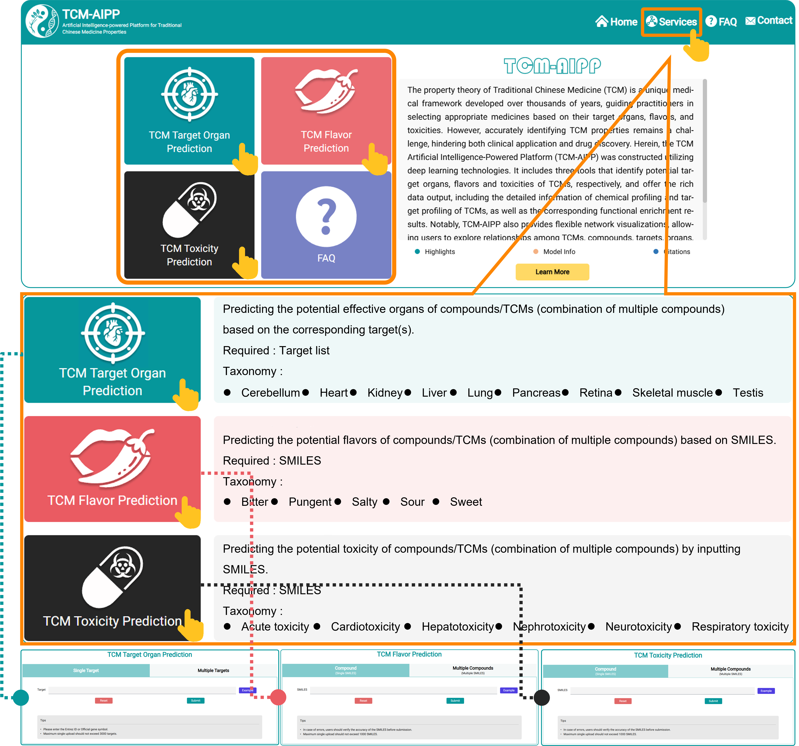

#### 3.4.1 TCM Target Organ Prediction

Users can input Official Gene Symbol(s) or Entrez Gene ID(s) of one or multiple targets and click Submit to predict target organs of TCMs (click on the example to see the demo). Multiple input supports up to 3000 targets. The latest release of TCM-AIPP supports prediction of nine organs, including cerebellum, heart, kidney, liver, lung, pancreas, retina, skeletal muscle and testis.

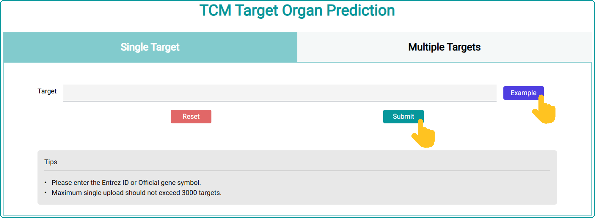

For a single input, TCM-AIPP will output basic information of the input target, its related-TCM and potential target organs. 

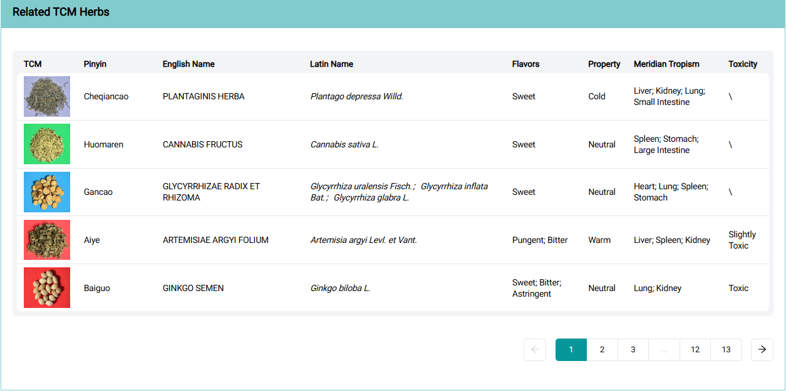
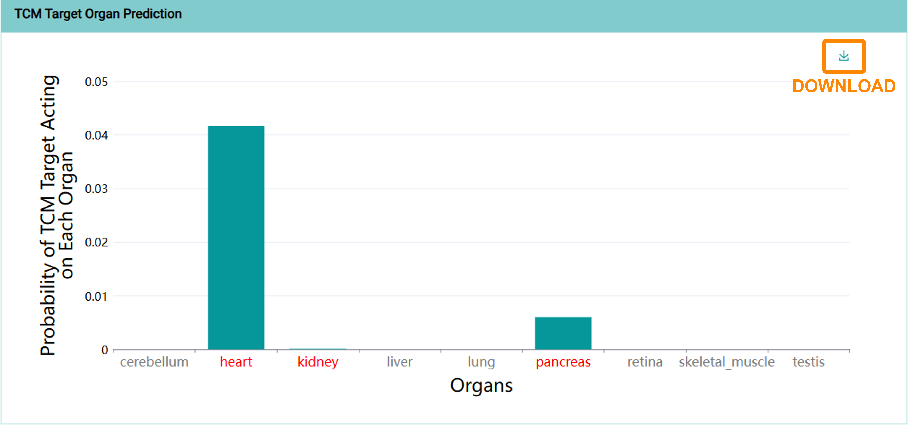
缺T4-网络

For multiple inputs, TCM-AIPP provides the statistic data regarding the potential target organs of TCMs acting on the input targets, accompanied by the detailed information of TCMs and the functions and pathways involved by their effective targets according to the enrichment analysis. All results are available for download in various forms of images and tables.

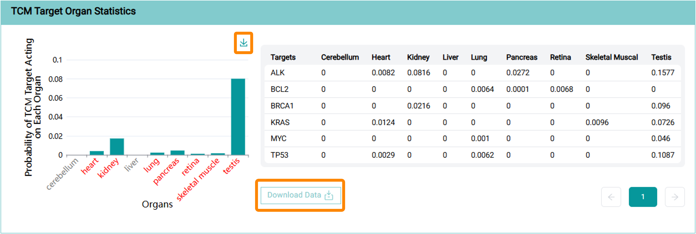
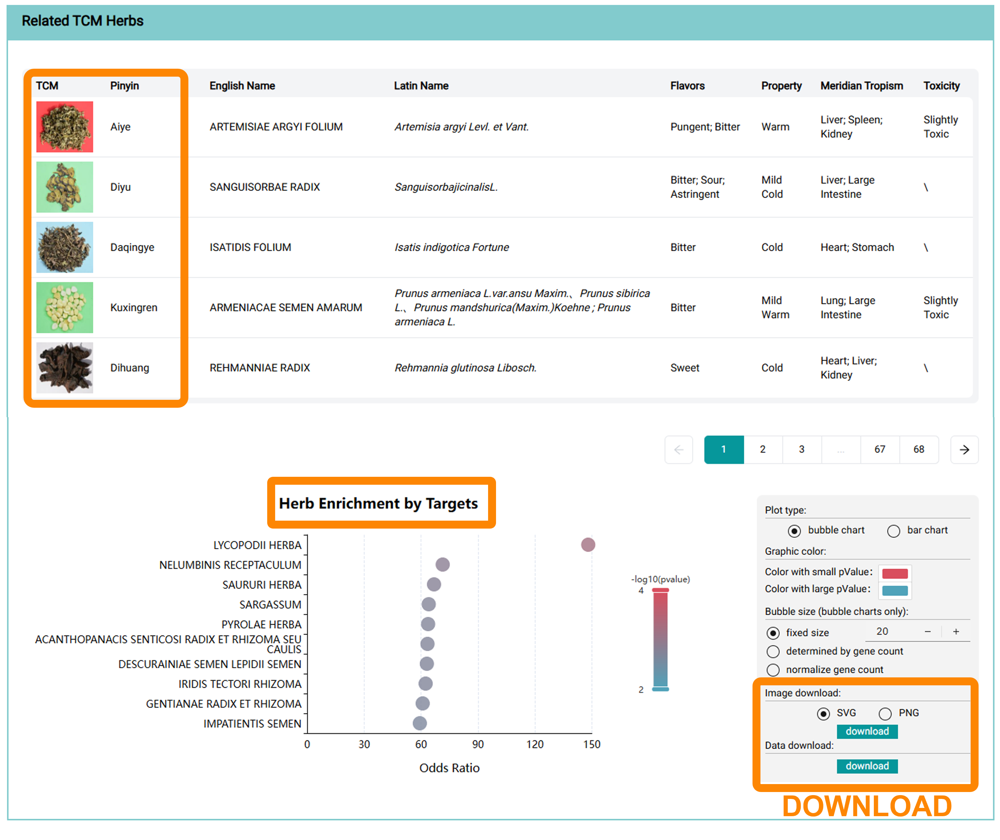
缺T7——富集
缺T8——网络
#### 3.4.2 TCM Flavor Prediction

Users can input SMILES string(s) of one or multiple compounds and click Submit to predict TCM flavors (click on the example to see the demo). Multiple input supports up to 1000 SMILES. We advise users to standardize SMILES via PubChem or RDKit before inputting them. The latest release of TCM-AIPP supports prediction of five flavors, including Bitter, Pungent, Salty, Sour and Sweet.

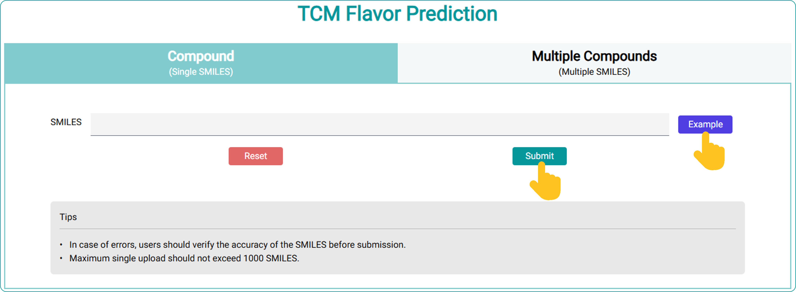

For a single input, TCM-AIPP generates structural diagrams and potential flavors of the input compound, as well as the related TCM and candidate targets. Additionally, TCM-AIPP also provides functions and pathways enriched by its candidate targets.

缺F2-雷达
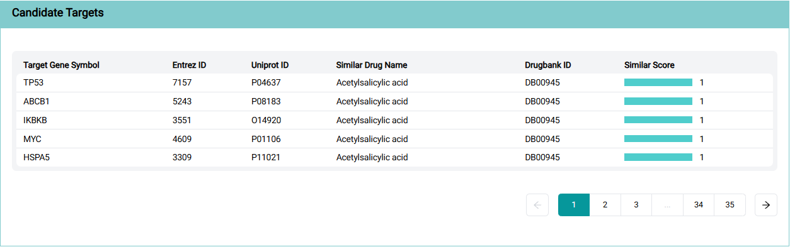
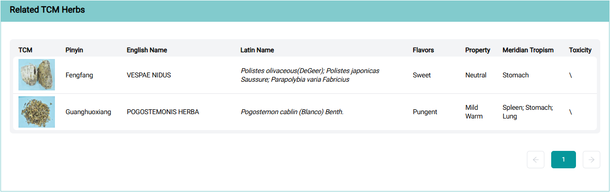
缺F5-富集
缺F6-网络

For multiple inputs, TCM-AIPP provides statistical data regarding the potential flavors of all compounds in question, accompanied by their candidate targets and the involved functions and pathways. Moreover, TCM-AIPP also lists TCMs containing the input compounds through enrichment analysis based on the SMILES Strings. All results are available for download in various forms of images and tables.

缺F7-汇总

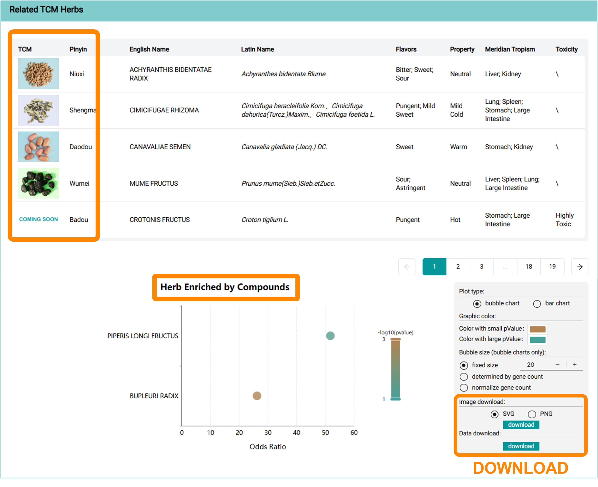
缺F9-汇总
缺F10-网络
**NOTE: The reliable scores of candidate targets provided herein are higher than 0.6**

#### 3.4.3 TCM Toxicity Prediction

Users can input SMILES string(s) of one or multiple compounds and click Submit to predict TCM toxicities (click on the example to see the case). Multiple input supports up to 1000 SMILES. We advise users to standardize SMILES via PubChem or RDKit before inputting them. The latest release of TCM-AIPP supports predictions for acute toxicity and common organ toxicities including cardiotoxicity, hepatotoxicity, nephrotoxicity, neurotoxicity, and respiratory toxicity, of TCMs.

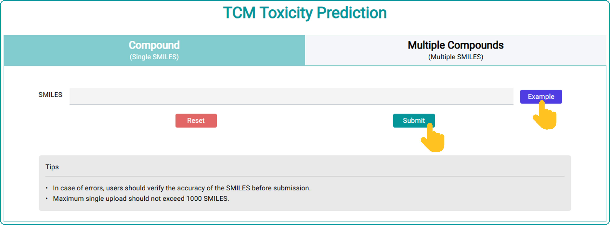

For a single input, TCM-AIPP generates structural diagrams and potential acute toxicity and organ toxicities of the input compound, as well as related TCM and candidate targets. Additionally, TCM-AIPP also provides functions and pathways enriched by its candidate targets.

缺TO2-结构
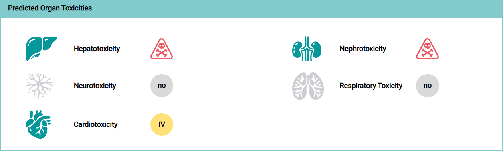

缺TO4-富集
缺TO-5网络

For multiple inputs, TCM-AIPP provides statistical data regarding the potential toxicities of all compounds in question, accompanied by the candidate targets and the involved functions and pathways. Moreover, TCM-AIPP also lists TCMs containing the input compounds through enrichment analysis based on the SMILES Strings. All results are available for download in various forms of images and tables.

缺TO-6汇总
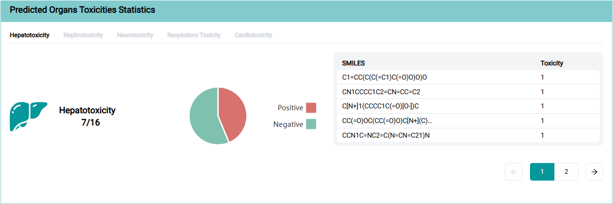

缺TO-8富集
缺TO-9网络

**NOTE: Two sampling methods were used to predict acute toxicity (see 2.4.1). For the same compound, we recommend selecting the lower grade as the reference. This approach is more conservative and is designed to avoid false negatives, which are more harmful than false positives. The reliable scores of candidate targets provided herein are higher than 0.6.**

## 4. API Tutorial

For users with more advanced analytical requirements, TCM-AIPP offers a straightforward POST interface that enables data to be queried through the programming language of your choice. While the site responds quickly, there may be a slight delay in Python scripts due to the queuing of user requests. Please note that a maximum of 100 API queries can be made per source IP per day, with query intervals becoming longer as the number of requesting models increases. To run the script, the system must have Python (version 3.12 or higher) installed and executed from the command line.

**For TCM Target Organ Prediction**

Please enter the Official gene symbol or Entrez ID for the query in order to proceed with this command. 
Please note: the targets should be entered with quotes and that multiple entries should be separated with commas.

  Example: 
  <pre><code>python tcmaipp_api.py -m m1 -o output.csv "Target"</code></pre>

**For TCM Flavor Prediction**

 Please enter the SMILES strings for the query in order to proceed with this command. 
 Please note: the SMILES strings should be entered with quotes and that multiple entries should be separated with commas.
 

  Example: 
  <pre><code>python tcmaipp_api.py -m m2 -o output.csv "SMILES"</code></pre>

**For TCM Toxicity Prediction**

Please enter the SMILES strings for the query in order to proceed with this command. 
Please note: the SMILES strings should be entered with quotes and that multiple entries should be separated with commas.

  Example: 
  <pre><code>python tcmaipp_api.py -m m3 -o output.csv "SMILES"</code></pre>

## 5. Acknowledgement

We would like to extend great appreciation to Beijing Bencaofangyuan Pharmacy Group LTD, Days in the north Chinese medicine yinpian Co.Ltd, Beijing Junda pharmaceutical Co.Ltd and Sichuan Zhongyao Yipian Co.Ltd for offering the photographs of TCMs displayed in this web server.

## 6. References
1.	Morselli Gysi, D., do Valle, I., Zitnik, M., Ameli, A., Gan, X., Varol, O., Ghiassian, S.D., Patten, J.J., Davey, R.A., Loscalzo, J. et al. (2021) Network medicine framework for identifying drug-repurposing opportunities for COVID-19. Proc Natl Acad Sci U S A, 118.
2.	Uhlen, M., Fagerberg, L., Hallstrom, B.M., Lindskog, C., Oksvold, P., Mardinoglu, A., Sivertsson, A., Kampf, C., Sjostedt, E., Asplund, A. et al. (2015) Proteomics. Tissue-based map of the human proteome. Science, 347, 1260419.
3.	Xiang, Z., Gong, W., Li, Z., Yang, X., Wang, J. and Wang, H. (2021) Predicting Protein-Protein Interactions via Gated Graph Attention Signed Network. Biomolecules, 11.
4.	Fritz, F., Preissner, R. and Banerjee, P. (2021) VirtualTaste: a web server for the prediction of organoleptic properties of chemical compounds. Nucleic Acids Res, 49, W679-W684.
5.	Kim, S., Chen, J., Cheng, T., Gindulyte, A., He, J., He, S., Li, Q., Shoemaker, B.A., Thiessen, P.A., Yu, B. et al. (2023) PubChem 2023 update. Nucleic Acids Res, 51, D1373-D1380.
6.	Rojas, C., Ballabio, D., Pacheco Sarmiento, K., Pacheco Jaramillo, E., Mendoza, M. and Garcia, F. (2022) ChemTastesDB: A curated database of molecular tastants. Food Chem (Oxf), 4, 100090.
7.	Wu, L., Yan, B., Han, J., Li, R., Xiao, J., He, S. and Bo, X. (2023) TOXRIC: a comprehensive database of toxicological data and benchmarks. Nucleic Acids Res, 51, D1432-D1445.
8.	De Carlo, A., Ronchi, D., Piastra, M., Tosca, E.M. and Magni, P. (2024) Predicting ADMET Properties from Molecule SMILE: A Bottom-Up Approach Using Attention-Based Graph Neural Networks. Pharmaceutics, 16.
9.	Zdrazil, B., Felix, E., Hunter, F., Manners, E.J., Blackshaw, J., Corbett, S., de Veij, M., Ioannidis, H., Lopez, D.M., Mosquera, J.F. et al. (2024) The ChEMBL Database in 2023: a drug discovery platform spanning multiple bioactivity data types and time periods. Nucleic Acids Res, 52, D1180-D1192.
10.	Pang, X., Yan, B., Zhou, J., Cao, X. and Peng, C. (2020) Research Progress of Chinese Materia Medica-induced Cardiotoxicity. Progress in Pharmaceutical Sciences, 44, 730-742.
11.	Yu, X., Xin, E., Yang, W., Huang, J., Guo, X., Lu, Y. and Li, Y. (2022) Research progress on the material basis and mechanism of toxic TCM medicine. Clinical Journal Of Chinese Medicine, 14, 141-145.
12.	Peng, P. and Yuan, W. (2021) Research progress on drug-induced hepatotoxicity of Chinese materia medica. Drug Eval Res, 44, 1783-1792.
13.	Hong, H., Du, W., Zhu, W., Hong, Z. and Ge, W. (2021) Research progress on organ toxicity of traditional Chinese medicine. China Journal of Traditional Chinese Medicine and Pharmacy, 36, 943-946.
14.	Xiong, F., Jiang, F., Xiong, A., Ju, Z., Yang, L. and Wang, Z. (2020) Quantification of hepatotoxie pyrrolizidine alkaloid adonifoline in traditional Chinese medicine preparations containing Senecionis Scandentis Herba. CHINA JOURNAL OF CHINESE MATERIA MEDICA, 45, 92-97.
15.	Zan, K., Jiang, H., Jin, H., Ma, S., Zhao, L. and Sun, Y. (2021) Research progress on quality control of hepatotoxic pyrrolizidine alkaloids in traditional Chinese medicine. Chinese Journal of Pharmaceutical Analysis, 41, 572-578.
16.	Knox, C., Wilson, M., Klinger, C.M., Franklin, M., Oler, E., Wilson, A., Pon, A., Cox, J., Chin, N.E.L., Strawbridge, S.A. et al. (2024) DrugBank 6.0: the DrugBank Knowledgebase for 2024. Nucleic Acids Res, 52, D1265-D1275.
17.	Connor, S., Li, T., Qu, Y., Roberts, R.A. and Tong, W. (2024) Generation of a drug-induced renal injury list to facilitate the development of new approach methodologies for nephrotoxicity. Drug Discov Today, 29, 103938.
18.	Yang, L., Wu, R., Sa, L. and Ao, W. (2023) Research progress on nephrotoxic components in traditional Chinese medicine and its toxic mechanisms. Chinese Traditional and Herbal Drugs 54, 7934-7952.
19.	Shang, H., Pang, X., Zhang, Q., Shi, X., Zhang, Y., Han, J. and Zheng, W. (2021) Research Progress of Toxicity Mechanisms in Kidney Injury Associated with Chinese Herbs and Its Compositions. HERALD OF MEDICINE, 40, 1210-1215.
20.	Lian, D., Hou, H., Zhang, G., Li, J., Ye, Z. and Peng, B. (2021) Neurotoxicity and mechanism of octopamine. Chin J Pharmacol Toxicol, 35, 788.
21.	He, H., Zhao, S., Xing, Y., Wang, Z., Du, L. and Shao, J. (2023) Research progress on material basis for neurotoxicity of traditional Chinese medicine and its mechanism. China Pharmacy, 34, 251-256.
22.	Hu, Z., Huang, L., Hou, J. and Wang, X. (2022) Research progress in toxicity of alkaloids in traditional Chinese medicine. Central South Pharmacy, 20, 633-641.
23.	Zong, S., Liu, Y., Sun, T., Zhang, H., Wang, C., Zhi, W. and Li, Y. (2020) Research Progress in the Toxicity and Control Methods of Asari Radix et Rhizoma. Chinese Pharmacist, 23, 942-945.
24.	Wang, Y., Zhang, H., Ma, D., Wu, D., Deng, X., Li, F., Wu, Q. and Guo, S. (2021) Amygdalin Ameliorates Respiratory Failure in Corpulmonale Rats and Regulates EGFR/MAPK Signaling Pathway. ZHEJIANG CHINESE MEDICAL UNIVERSITY XUE BAO, 45, 384-390.
25.	Zhang, Y., Li, X., Shi, Y., Chen, T., Xu, Z., Wang, P., Yu, M., Chen, W., Li, B., Jing, Z. et al. (2023) ETCM v2.0: An update with comprehensive resource and rich annotations for traditional Chinese medicine. Acta Pharm Sin B, 13, 2559-2571.
